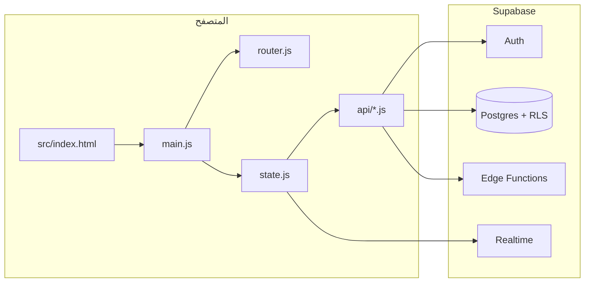

# MONY — توثيق المشروع

تطبيق ويب (SPA) لإدارة الحوالات المالية والمصروفات والتقارير، مع **أدوار مستخدمين** و**مهام داخلية** و**مزامنة جزئية دون اتصال**. الواجهة بالعربية واتجاه RTL.

---

## 1. نظرة عامة

| العنصر | الوصف |
|--------|--------|
| **الواجهة** | صفحة واحدة تُحمَّل من `src/index.html`، المنطق في `src/main.js` |
| **التنقل** | Hash router (`#/dashboard-style paths`) عبر `src/router.js` |
| **البيانات** | Supabase (Auth + Postgres + Row Level Security + Realtime) |
| **API** | إما **Edge Functions** (مستحسن) أو جداول مباشرة عند `useEdgeFunctions: false` |
| **الأنماط** | Tailwind عبر CDN + `src/styles/main.css` |

نقطة الدخول للمستخدم: الجذر `index.html` يعيد التوجيه إلى **`src/index.html`**.

---

## 2. المميزات الرئيسية

- **لوحة تحكم حية**: ملخص التقارير، بطاقات، أدوات Spiral و Timeline، سحب لإعادة ترتيب البطاقات.
- **الحوالات**: إضافة، قائمة، تفاصيل حوالة، عملات متعددة (SAR / YER / AED … حسب الإعدادات).
- **المصروفات**: مرتبطة بحوالة، قائمة وتعديل/حذف حسب الصلاحيات.
- **التقارير**: فترات (يوم / أسبوع / شهر / الكل) مع تجميع حسب العملة.
- **المهام الداخلية**: إنشاء وتعيين (مدير/مسؤول)، تتبع عبر `task_events`، بريد إشعارات اختياري (Resend من Edge).
- **المستخدمون والأدوار**: `user` | `manager` | `admin`؛ إدارة المستخدمين للمسؤول عبر Edge `admin-users`.
- **المصادقة**: تسجيل دخول بكلمة المرور، **Magic Link** عبر البريد، تسجيل حساب جديد.
- **PWA**: `manifest` + `service worker` (`src/sw.js`)، طابور عمليات محلي عnd نفاذ ضعيف للشبكة (حوالات/مصروفات محدودة).
- **Realtime**: تحديث القوائم والتقارير عند تغيّر `transactions`, `expenses`, `tasks`, إلخ.
- **ثيم**: فاتح/داكن، تخصيص ألوان محلي (localStorage).

---

## 3. هيكل المشروع (ملفات مهمة)

```
MONY/
├── index.html                 # إعادة توجيه إلى src/index.html
├── README.md                  # هذا الملف
├── src/
│   ├── index.html             # التطبيق: MONY_CONFIG + shell + auth gate
│   ├── main.js                # التهيئة، الثيم، التنقل، نماذج الدخول، الموصلات
│   ├── router.js              # مسارات الهاش، navigate، pathToLabel
│   ├── state.js               # حالة مركزية، تحميل البيانات، realtime، مزامنة دون اتصال
│   ├── api/
│   │   ├── supabaseClient.js  # عميل Supabase
│   │   ├── apiClient.js       # edgeFetch (Timeout + Retry + رسائل آمنة)
│   │   ├── transactions.js
│   │   ├── expenses.js
│   │   ├── reports.js
│   │   ├── tasks.js
│   │   ├── adminUsers.js
│   │   └── auth.js            # دوال مساعدة قديمة/بديلة
│   ├── pages/                 # ربط الصفحات بالـ state والـ API
│   ├── views/                 # قوالب DOM فقط + أحداث واجهة
│   ├── components/            # card, form, modal, …
│   ├── utils/                 # constants, helpers, validators
│   ├── offline/syncQueue.js
│   ├── sw.js
│   ├── styles/main.css
│   └── manifest.webmanifest
└── supabase/
    ├── migrations/            # مخطط SQL + RLS + Realtime
    ├── functions/             # Edge Functions (Deno)
    └── browser-paste/         # تذكير طريق النشر / لصق يدوي
```

**قاعدة التنظيم:** الصفحات (`pages/`) تستورد العرض من `views/` ولا تكرّر منطق الشبكة إن أمكن؛ الثوابت والمسارات في `utils/constants.js`.

---

## 4. التهيئة (العميل)

في **`src/index.html`** يُعرَّف الكائن العام:

```js
window.MONY_CONFIG = {
  supabaseUrl: "https://<project>.supabase.co",
  supabaseAnonKey: "<anon-public-key>",
  useEdgeFunctions: true   // false = وصول مباشر للجداول (نفس سياسات RLS تقريباً)
};
```

- **لا ترفع مفتاح `service_role` إلى الواجهة.** يبقى سراً في Supabase (بيئة Edge فقط).
- بعد تغيير الدالة `tasks` أو غيرها، تأكد أن أسماء الـ slugs تطابق `EDGE_FUNCTION_SLUGS` في `constants.js`.

---

## 5. كيف يعمل التطبيق (تدفق مختصر)



1. **`main.js`** يُظهر بوابة الدخول أو الـ shell حسب الجلسة.
2. **`state.bootState()`** يقرأ الجلسة، يحمّل الملف الشخصي، ثم الحوالات/المصروفات/التقارير/المهام، ويشغّل قناة Realtime.
3. **`router`** عند تغيّر `#/...` يستدعي `mountRoute` لتركيب صفحة من `pages/*`.
4. الطلبات: **`edgeFetch`** (لـ GET/POST/…) مع Bearer من جلسة المستخدم، أو **`getSupabase()`** للجداول عند تعطيل Edge.

---

## 6. المسارات (Routing)

تُعرَّف في `utils/constants.js` (`ROUTES`, `ROUTE_LABELS`).

| المسار | الوصف |
|--------|--------|
| `/` | لوحة التحكم |
| `/add-transaction` | إضافة حوالة |
| `/transactions` | قائمة الحوالات |
| `/transactions/{uuid}` | تفاصيل حوالة |
| `/expenses` | المصروفات |
| `/add-expense?transaction_id=` | إضافة مصروف مرتبط بحوالة (validate في `main.js`) |
| `/reports` | التقارير |
| `/tasks` | المهام |
| `/tasks/{uuid}` | تفاصيل مهمة |
| `/admin-users` | المستخدمون (يُسمح بها لـ manager/admin في التنقل) |

---

## 7. الأدوار والصلاحيات (ملخص)

- **`user`**: يرى بياناته (حوالات/مصروفات/مهام مرتبطة به) وفق RLS.
- **`manager` / `admin`**: يرون بيانات الجميع للمالية؛ يمكنهم إنشاء المهام وتعديلها/حذفها؛ **`admin`** فقط يغيّر أدوار المستخدمين عبر `admin-users` (حسب تنفيذ الدالة).

تفاصيل القيود في ملفات الهجرة، خصوصاً `20250326000000_profiles_roles_staff_rls.sql` و`20250328120000_tasks.sql`.

---

## 8. Supabase: الهجرات والدوال الحافة

### 8.1 هجرات SQL (`supabase/migrations/`)

تُنفَّذ بالترتيب الزمني في الاسم. تشمل على سبيل المثال:

- مخطط الحوالات والمصروفات و`updated_at`.
- الملفات الشخصية والأدوار و`is_staff()` / `is_admin()`.
- سياسات RLS للجداول المالية والمهام و`task_events`.
- إضافة الجداول لمنشور Realtime حيث يلزم.

### 8.2 Edge Functions (`supabase/functions/`)

| Slug | الملف | الغرض |
|------|--------|--------|
| `transactions` | `transactions/index.ts` | CRUD الحوالات |
| `expenses` | `expenses/index.ts` | CRUD المصروفات |
| `reports` | `reports/index.ts` | تقارير مجمّعة |
| `admin-users` | `admin-users/index.ts` | قائمة مستخدمين، إنشاء، تعديل دور (مسؤول) |
| `tasks` | `tasks/index.ts` | CRUD المهام + تسجيل `task_events` + بريد (Resend اختياري) |

**أسرار مفيدة للمهام (بريد):**

- `RESEND_API_KEY`
- `RESEND_FROM` (مثل `MONY <noreply@yourdomain.com>`)

بدون Resend تستمر المهام والسجل؛ الإشعارات بالبريد تُتخطّى.

---

## 9. المهام (ميزة `tasks`)

- **جدول `tasks`**: عنوان، وصف، أولوية، حالة، موعد نهائي، `created_by`, `assigned_to`.
- **جدول `task_events`**: سجل أحداث (إنشاء، تعيين، تغيير حالة، …).
- **قيد على مستوى DB**: المكلف يعدّل **الحالة والوصف** فقط (يُفرض أيضاً من منطق Edge).
- **الواجهة**: `views/tasksView.js` + `pages/tasksPage.js` + `api/tasks.js` وتكامل في `state.js` و`main.js`.

---

## 10. الأداء والاستقرار (عميل)

- **`apiClient.js`**: مهلة للطلبات، إعادة محاولة لطلبات GET، تقليل تسرّب رسائل الخطأ الخام للمستخدم.
- **`reports.js`**: تخزين مؤقت قصير وتقليل ازدواجية الطلبات.
- **`state.js`**: تنسيق تحميل ما بعد البدء لتقليل تكرار جلب التقارير؛ تحميل المهام مع باقي الحزمة عند الدخول.

---

## 11. العمل دون اتصال (حدوده)

- طابور في `offline/syncQueue.js` لعمليات محددة على الحوالات/المصروفات عند انقطاع الشبكة.
- لا يغني عن مراجعة التعارضات المعقّدة؛ الهدف تحسين التجربة عند انقطاع مؤقت.

---

## 12. التشغيل المحلي للواجهة

التطبيق **ثابت** (لا يتطلب `npm run dev` إلزامياً):

1. ضع `MONY_CONFIG` في `src/index.html`.
2. افتح `src/index.html` عبر خادم محلي بسيط (مستحسن لتفادي قيود ملف `file://` و Service Worker):

```bash
# مثال مع Python
cd src
python -m http.server 8080
```

ثم افتح `http://localhost:8080/index.html`.

---

## 13. النشر مع Supabase (مختصر)

1. إنشاء مشروع Supabase وتطبيق **كل** ملفات `supabase/migrations/` على قاعدة البيانات.
2. نشر الدوال من مجلد `supabase/functions/` بأسماء slugs المطابقة لـ `EDGE_FUNCTION_SLUGS`.
3. التأكد من تفعيل **Auth** (البريد، Magic Link، Redirect URLs لبيئة الإنتاج).
4. رفع مجلد **`src/`** (أو كل المشروع الثابت) على استضافة ثابتة أو CDN؛ ضبط `MONY_CONFIG` لبيئة الإنتاج.

---

## 14. صيانة التوثيق

- عند إضافة **مسار جديد**: حدّث `ROUTES` و`ROUTE_LABELS` و`router.pathToLabel` إن لزم، و**هذا README** وقسم المسارات.
- عند إضافة **Edge Function جديدة**: أضف slug في `constants.js` + مجلد تحت `supabase/functions/` + اذكر السرّ إن وُجد.

---

**الإصدار الموثّق:** وفق هيكل المستودع الحالي (واجهة SPA + Supabase + مهام + مصادقة بالبريد). للتفاصيل البرمجية الدقيقة راجع التعليقات داخل الملفات والهجرات SQL.
